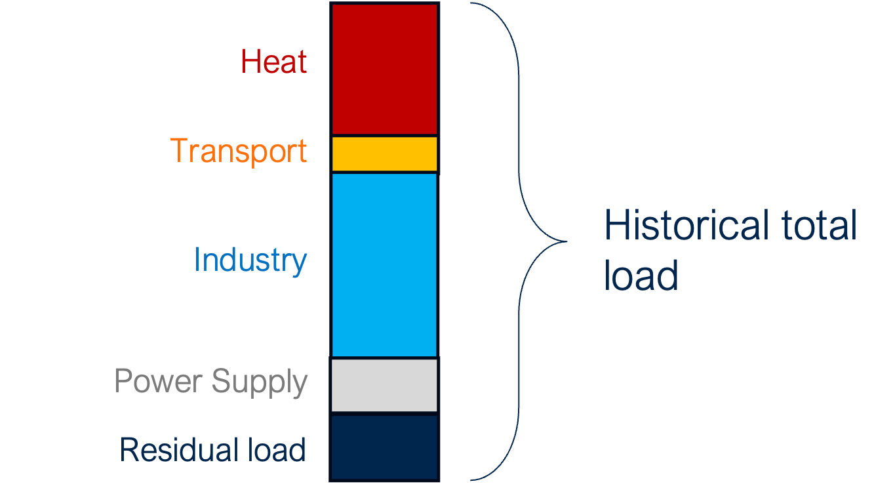

..
  SPDX-FileCopyrightText: 2019-2023 The PyPSA-Eur Authors

  SPDX-License-Identifier: CC-BY-4.0

.. _veka_configurations:

##########################################
Model modifications
##########################################

To better match client needs, various modifications have been added to PyPSA-Eur. Two main needs have been implemented :

* We added the ability to define an future electric load based on scenarios developed in the `2050 Pathways Explorer <https://pathwaysexplorer.climact.com>`_ (see :ref:`Future electric load`).
* We added the possibility to enforce technology phase out to better match political visions (see :ref:`Technology phase out`).

To implement this, various rules have been added (see :ref:`Rules added`).

Future electric load
===========================
By default, PyPSA-Eur uses the historical electric load of a reference year for each country as load for future planning horizons. Given the pathways defined by the `2050 Pathways Explorer <https://pathwaysexplorer.climact.com>`_, we now know that this is an assumption to avoid.

The variable electric load for future planning horizons is computed based on :

* an hourly demand per country for a reference year (from ENTSO-E as already used in PyPSA-Eur),
* an hourly profiles per sector (representing which percentage of the sectorial annual load is consumed at each hour) (as already used in PyPSA-Eur),
* an annual demand per sector per country for a reference year (from 2050 Pathways Explorer),
* an annual demand per sector per country for future planning horizons (from 2050 Pathways Explorer).

Methodology
---------------------------

From this historical load, the historical electricity used :

* In the heat sector is removed from the total load to let PyPSA optimize the supply of historical heat demand ;
* In the industry sector is modified to fit future industry energy demand.

The residual share of electricity is otherwise considered constant over future planning horizons, which however does not take into account the evolution of appliances consumption.

The model has hence been modified to take into account the evolution of each sector's consumption. The annual sectorial electric demand projection for future horizons is extracted for each country from the `2050 Pathways Explorer <https://pathwaysexplorer.climact.com>`_.

The future hourly electric demand for future planning horizons it build by :

* Building a reference hourly demand for each sector, based on defined sector profiles and on annual demand ;
* Building a reference hourly profile for the Residual load sector based on the reference hourly demand and on the hourly sectorial demand ;
* Building future hourly demands based on defined and built sector profiles and on future annual demands

As it appears that PyPSA-Eur uses the residual historical electricity load growth of appliances is not taken into account even though it evolved over time

* 27.5TWh in 2013
* 25.7TWh in 2022
* 32.2TWh in 2030
In Belgium using according to Climact's previsions for Elia 

- Lien vers l'étude ELIA # ToDo VLA

Future annual demand
---------------------------

The `2050 Pathways Explorer <https://pathwaysexplorer.climact.com>`_ is a simulation tool able to assess and build scenarios for sectors-coupled and multi-carrier energy systems. It allows in-depth insights in system evolution through societal, technological, political choices. Typical outputs are energy demand, GHG emissions and end-use demand on a yearly basis. It can be used to provide the annual electrical load per country according to country specific scenarios for future years, with a granularity up to sub-sectors.

PyPSA-Eur is an optimization tool able to tackle and assess more precisely intermittency and fast response phenomena. It explores the impact of the energy transition on transmissions infrastructures. It determines costs for an optimal energy system.

Both have their strength. This is why we used the `2050 Pathways Explorer <https://pathwaysexplorer.climact.com>`_ to determine transition pathways and derive future annual electric load for sub-sectors and countries. Those loads are then used to determine future load profiles.

PyPSA-Eur considers JRC-IDEES historical load per country on an annual basis for hot water and space heating purpose for residential and services sub-sectors.  SEE DOC FROM ENERGY DEMAND AND SUPPLY

Future profiles
---------------------------

Annual electricity demands defined by the 2050 Pathways Explorer are spread into the following sectors :

* Heat
* Transport
* Industry
* Power Supply (losses and refineries)
* Residual load (others)

Each of those sectors are modeled except the residual load which, by definition, is defined as what is left after subtracting the total load different sectors, meaning no particular profile is defined for it.

* Heat : Heat electrical demand profile is calculated similarly to PyPSA-methodology for space heating and hot water demand :

  * An intraday hourly profile, depending on the sector (residential/service), the heat type (hot water/space heating)and on week days/week-ends
  * An annual daily profile, considered flat for hot water and spread across the year according the daily average Heating Degree Day considering a threshold temperature of 15°C
* Transport	: Transport electrical demand profiles are based on hourly profiles available at a week scale provided by the German Federal Highway Research Institute (BASt). Profiles for different types of vehicles are available ; the profile of all land transport types vehicles combined is considered as a proxy for electric rail, as no profile is available.
* Industry 	: Industry electrical demand profile is considered as flat over the whole year
* Power supply : Power supply electrical demand profile (i.e. losses) is considered to be proportional to the total load for each time frame. Losses are assumed to be equal to represent 5% of the total load.

Technology phase out
===========================

Some scenarios might want to explore what a future energy system would look like considering specific technological phase out. This is especially a need when we try to model political choices like a ban on coal power plants by 2030.

A new option has been added to phase out before a given year assets of a specified conventional technologies. Two kinds of assets have to be considered:

* Existing assets: Existing asset lifetime are adapted so that they are removed starting from the phase out date.
* New assets: The lifetime of new assets is adapted to make sure they are removed at their phase out date. When lifetime is reduced, annualized investment costs for new assets are adapted accordingly. This is reflected through a higher annuity in the annualized capital cost calculation.

**Releveant Settings**

.. code:: yaml

    existing_capacities:
        exit_year:

Rules added
===========================

Here is the list of rules added for the project. The documentation related to them has been added into the PyPSA-Eur documentation itself.

- :mod:`retrieve_load_futur`
- :mod:`build_country_profiles`
- :mod:`build_residual_load_profile`
- :mod:`build_future_load`
- :mod:`add_electricity_tomorrow`

Those rules have been integrated in PyPSA-Eur workflow to ease their usage.

.. figure:: img/rulegraph_additions.png
    :class: full-width
    :alt: Rule graph

External links
===========================

During the implementation phase of this project, external issues have been tracked in appropriated package repository.

- Improve Gurobi usage for `linopy` package (https://github.com/PyPSA/linopy/pull/162)
- Raised issue for `snakemake` package to better manage Gurobi licenses (https://github.com/snakemake/snakemake/issues/1801)
- Raised issue for `pulp` package to better manage Gurobi licenses (https://github.com/coin-or/pulp/issues/571)