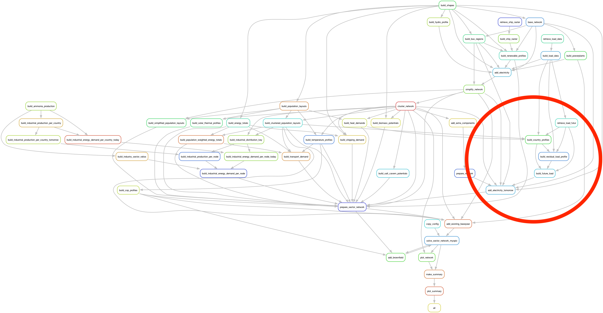

..
  SPDX-FileCopyrightText: 2019-2023 The PyPSA-Eur Authors

  SPDX-License-Identifier: CC-BY-4.0

.. _veka_configurations:

##########################################
Model modifications
##########################################

To better match client needs, various modifications have been added to PyPSA-Eur. Two main needs have been implemented:

* We added the ability to define a future electric load based on scenarios developed in the `2050 Pathways Explorer <https://pathwaysexplorer.climact.com>`_ (see :ref:`Future electric load`).
* We added the possibility to enforce technology phase out to better match political visions (see :ref:`Technology phase out`).

To implement this, various rules have been added (see :ref:`Rules added`).

Future electric load
===========================
By default, PyPSA-Eur uses the historical electric load of a reference year for each country as load for future planning horizons. When sector coupling is activated, the historical heat demand electric load is removed from the total load for future plannings horizons to let PyPSA optimize the supply and the historical industry electric load is modified to reflect the industry energy demand evolution. Given the pathways defined by the `2050 Pathways Explorer <https://pathwaysexplorer.climact.com>`_, we now know that this is not sufficient to deal with client needs. Therefore, we have implemented a new way to define future electric load.

The variable electric load for future planning horizons is computed based on:

* an hourly demand per country for a reference year (from ENTSO-E as already used in PyPSA-Eur) ;
* hourly profiles per sector (representing which percentage of the sectorial annual load is consumed at each hour) (as already used in PyPSA-Eur) ;
* an annual demand per sector per country for the same reference year (from 2050 Pathways Explorer) ;
* an annual demand per sector per country for future planning horizons (from 2050 Pathways Explorer).

Methodology
---------------------------

To add an hourly future electric load on the network using the yearly `2050 Pathways Explorer <https://pathwaysexplorer.climact.com>`_ data, different steps are required:

#. Retrieve yearly electric load from 2050 Pathways Explorer using its API ;
#. Build a reference hourly country profile for each sub-sectors based on intra-days assumptions for heat and weekly assumptions for transport. Industry profile is considered constant and power supply profile is considered to be proportional to the total load ;
#. Build a reference residual load profile as the left over after subtracting the total load of the reference year to the load of the different sectors for this same year ;
#. Build a future load using the annual future load and the built profiles (incl. heat, transport, industry, power supply and residual load profiles) ;
#. Add this load to the network.

This methodology implies that the residual share of electricity is considered constant over future planning horizons. This does not take into account the evolution of appliances consumption. This is a limitation as we know from `Climact's short term projections for ELIA Adequacy working group <https://www.elia.be/fr/users-group/adequacy-working-group/20230825-meeting>`_ that this share is not constant. In this study, we assessed a future demand of 32.2TWh in 2030 for appliances (knowing that we were at 27.5TWh in 2013 and 25.7TWh in 2022).

Future annual demand
---------------------------

The `2050 Pathways Explorer <https://pathwaysexplorer.climact.com>`_ is a simulation tool able to assess and build scenarios for sector-coupled and multi-carrier energy systems. It allows in-depth insights in system evolution through societal, technological, political choices. Typical outputs are energy demand, GHG emissions and end-use demand on a yearly basis. It can be used to provide the annual electrical load per country according to country specific scenarios for future years, with a granularity up to sub-sectors.

PyPSA-Eur is an optimization tool able to tackle and assess more precisely intermittency and fast response phenomena. It explores the impact of the energy transition on transmissions infrastructures. It determines costs for an optimal energy system.

Both have their strengths. This is why we used the `2050 Pathways Explorer <https://pathwaysexplorer.climact.com>`_ to determine transition pathways and derive future annual electric loads for sub-sectors and countries. Those loads are then used to determine future load profiles.

Future profiles
---------------------------

Future annual electricity demand profiles are spread into the following sectors and sub-sectors:

* Heat: residential and services for hot water and space heating ;
* Transport: cars, bus, light duty vehicles, heavy duty vehicles and train ;
* Industry: no sub-sector considered ;
* Power Supply: losses.

For each one of those sectors, a future electrical demand profile is determined:

* **Heat** : Heat electrical demand profile is calculated similarly to the PyPSA methodology:

  * An intraday hourly profile is built based on sub-sectors (residential or service), heat types (hot water or space heating) and days of the week (week days or weekends ;
  * An annual daily profile is used for each sub-sector. The profile is considered as flat for hot water. A daily profile is used for space heating accordingly to the daily average Heating Degree Day (HDD) considering a threshold temperature of 15°C.
* **Transport** : Transport electrical demand profiles are based on hourly profiles available at a week scale provided by the German Federal Highway Research Institute (BASt). Profiles for different types of vehicles are used. As no profile is available for electric rail, the combined profile of all land transport vehicle types is considered as a proxy.
* **Industry** : Industry electrical demand profile is considered to be flat over the whole year.
* **Power supply** : Power supply electrical demand profile (assumed to be losses) is considered to be proportional to the total load at each time. Losses are assumed to represent 5% of the total load (industry, heat, transport and residual load).

Each of those sectors are modeled except the residual load which is, by definition, the left over after subtracting the total load of the reference year to the load of the different sectors for this same year. This means that no particular profile is defined for it.

Technology phase out
===========================

Some scenarios might want to explore what a future energy system would look like, considering specific technological phase out. This is especially a need when we try to model political choices like a ban on coal power plants by 2030.

A new option has been added to phase out, before a given year, assets of a specified conventional technology. Two kinds of assets have to be considered:

* **Existing assets** :  The lifetime of existing assets is adapted so that they are removed starting from the phase out date ;
* **New assets** The lifetime of new assets is adapted to make sure they are removed at their phase out date. When lifetime is reduced, annualized investment costs for new assets are adapted accordingly. This is reflected through a higher annuity in the annualized capital cost calculation.

**Relevant Settings**

.. code:: yaml

    existing_capacities:
        exit_year:

Rules added
===========================

Here is the list of rules added for the project. The documentation related to them has been added into the PyPSA-Eur documentation itself.

- :mod:`retrieve_load_futur`
- :mod:`retrieve_irena`
- :mod:`build_country_profiles`
- :mod:`build_residual_load_profile`
- :mod:`build_future_load`
- :mod:`add_electricity_tomorrow`

Those rules have been integrated in PyPSA-Eur workflow to ease their usage.

External links
===========================

During the implementation phase of this project, external issues have been tracked in appropriated package repository.

- Improve Gurobi usage for `linopy` package (https://github.com/PyPSA/linopy/pull/162);
- Raised issue for `snakemake` package to better manage Gurobi licenses (https://github.com/snakemake/snakemake/issues/1801);
- Raised issue for `pulp` package to better manage Gurobi licenses (https://github.com/coin-or/pulp/issues/571).
